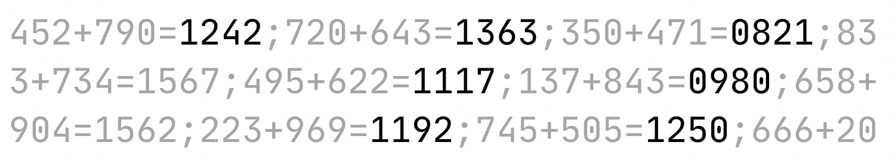
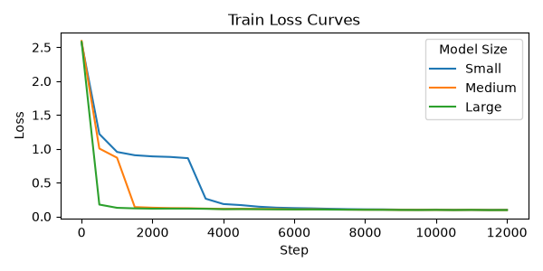
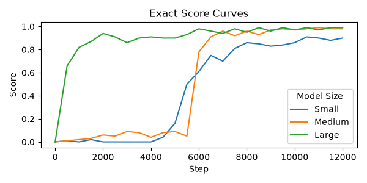
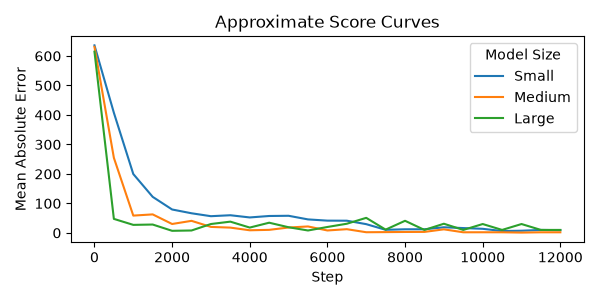

# gpt-add

Learning addition with a GPT model based on [nanoGPT](https://github.com/karpathy/nanoGPT).

👉 Companion [blog post](https://medium.com/@romainflorentz/learning-addition-with-gpt-942dc4b72210)

## The Problem

We are given a text dataset representing a series of equations in the form `x + y = z`, where `x` and `y` are three-digit integers. The dataset consists of 1 million unique equations, each represented with leading zeroes to maintain consistent positional encoding and simplify batching.

Sample dataset:

```
452+790=1242;720+643=1363;350+471=0821;83
3+734=1567;495+622=1117;137+843=0980;658+
904=1562;223+969=1192;745+505=1250;666+20
...
```

We use the GPT model from nanoGPT. The model is trained to predict the next token by minimizing the loss across all batches.

## Training GPT

### Model Configurations

| Size   | $d_{\textrm{model}}$ | $N$ | $h$ | Params |
|--------|----------------------|-----|-----|--------|
| Small  | 32                   | 2   | 2   | 0.03M  |
| Medium | 64                   | 2   | 2   | 0.1M   |
| Large  | 128                  | 2   | 2   | 0.4M   |

### Training Specifications

- **Training set**: 100k equations
- **Test set**: 450k equations
- **Batch size**: 32
- **Block size**: 120
- **Learning rate**: starts at 0.001, then is reduced with a scheduler
- **Hardware**: MacBook Air, 8GB RAM, M2 chip using PyTorch 2.5.1

### Results





## Update (2026)

Rerun with PyTorch 2.13 (managed with [uv](https://docs.astral.sh/uv/)), two bug fixes and one upgrade:

- Fixed a regression that dropped the leading-zero padding from generated equations, capping the exact score at ~50%.
- Fixed the loss mask, which silently trained on the left-hand side of equations in about half of the batches (visible above as the ~0.85 train loss floor).
- The transformer weights now train with [Muon](https://kellerjordan.github.io/posts/muon/) (`torch.optim.Muon`), with per-iteration cosine annealing.

Compared to the 2024 results above, all three models now learn exact addition within 12k steps instead of 50k, reaching 90% / 98% / 99% exact score for small / medium / large:



